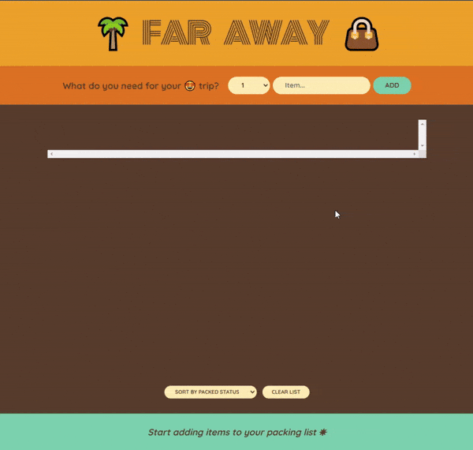
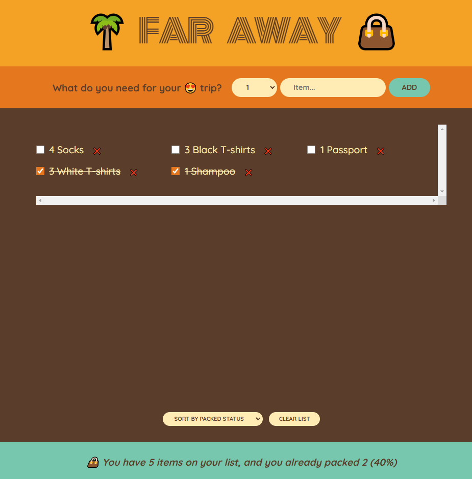
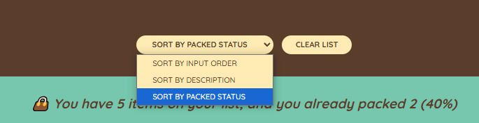

# 🧳 Packing List App

The **Packing List App** is a simple and interactive React application designed to help users organize and manage their packing for trips. Add, delete, sort, and track the status of your items with ease while enjoying a clean and intuitive interface.



---

## 🚀 Features

### **1. Add Items**
- Quickly add items to your packing list with their quantity and description.
- Prevents empty entries for better data validation.

### **2. Delete Items**
- Remove individual items effortlessly with a single button click.

### **3. Toggle Packed Status**
- Mark items as packed or unpacked using a checkbox, with visual feedback (line-through text for packed items).

### **4. Sort Items**
- Sort items in the list by:
  - Input Order (default)
  - Description (alphabetical)
  - Packed Status

### **5. Clear All Items**
- Clear your entire packing list with a single button (with confirmation to avoid accidental deletion).

### **6. Packing Statistics**
- Dynamic footer displays:
  - Total number of items.
  - Number of packed items.
  - Packing progress as a percentage.
- Celebratory message when all items are packed!

---

## 🛠️ Technologies Used

- **React**: Component-based UI development.
- **JavaScript (ES6+)**: Functional programming concepts and modern syntax.
- **CSS**: Basic styling for layout and user experience.

---


## 📖 What I Learned

This project helped me deepen my understanding of React fundamentals and explore the following concepts:

1. **State Management**:
   - Using `useState` to handle dynamic data.
   - Ensuring immutability while updating state.

2. **Component-Based Architecture**:
   - Building reusable and modular components for scalability.

3. **Props and Component Communication**:
   - Passing data and functions between components effectively.

4. **Array Methods**:
   - Leveraging `map`, `filter`, and `sort` for dynamic data manipulation.

5. **Event Handling**:
   - Managing user interactions such as form submissions and button clicks.

6. **Conditional Rendering**:
   - Enhancing user feedback through dynamic content.

---

## 🌟 Future Improvements

- **Persistent Storage**:
  - Add local storage or database integration to save packing lists across sessions.
  
- **Enhanced UX/UI**:
  - Include categories or icons for better organization.
  - Improve design for responsiveness and accessibility.

- **Advanced Features**:
  - Add user authentication to save and sync lists for different trips.

---

## 🧑‍💻 Getting Started

### Prerequisites
- Node.js installed on your local machine.

### Installation
1. Clone the repository:
   ```bash
   git clone https://github.com/Kvrolix/TravelList.git
   ```
2. Navigate to the project directory:
   ```bash
   cd TravelList
   ```
3. Install dependencies:
   ```bash
   npm install
   ```
4. Start the development server:
   ```bash
   npm start
   ```

---

## 📷 Screenshots






---

## 🤝 Contributions
The projects have been completed during the Jonas Schmedtmann course. 

---


Happy Packing! ✈️
```

You can replace placeholders like `your-username` and `your.email@example.com` with your actual GitHub username and contact information. Add screenshots or demo GIFs to visually showcase your app!
